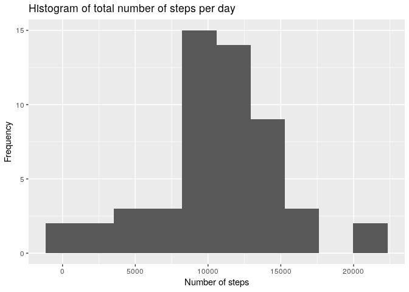

## Loading and preprocessing the data

Let's first load up the helper libraries:


```r
library(tidyverse)
library(lubridate)
library(scales)
```

The dataset is already present in the repositury. Let's just unzip it and load it up:


```r
# let's extract the dataset first:
unzip("activity.zip")

dataset <- read_csv("activity.csv")
```

## What is mean total number of steps taken per day?

Let's first subset the data to only work with complete cases:


```r
completes <- dataset[complete.cases(dataset), ]
```

We're interested in the total number of steps taken on each day:


```r
completes_with_totals <-
  completes %>%
  group_by(date) %>%
  summarize(total=sum(steps))

mean_total_steps <- completes_with_totals$total %>% mean
median_total_steps <- completes_with_totals$total %>% median

print(paste("Mean total steps:", mean_total_steps))
```

```
## [1] "Mean total steps: 10766.1886792453"
```

```r
print(paste("Median total steps:", median_total_steps))
```

```
## [1] "Median total steps: 10765"
```

Now, let's plot a histogram. It's a bar plot in its essense, counting up the total number of occurances per some dimension. This is exactly what we have computed in the last step.


```r
completes_with_totals %>%
  ggplot(aes(date, total)) +
  geom_bar(stat="identity", width=0.75) +
  geom_hline(yintercept=mean_total_steps, colour="red") +
  annotate(
    "text",
    x=min(completes_with_totals$date) + 8,
    y=mean_total_steps - 800,
    label=paste("mean = ", mean_total_steps),
    colour="red"
  ) +
  geom_hline(yintercept=median_total_steps, colour="orange") +
  annotate(
    "text",
    x=max(completes_with_totals$date) - 5,
    y=median_total_steps - 800,
    label=paste("median = ", median_total_steps),
    colour="orange"
  )
```

<!-- -->


## What is the average daily activity pattern?

For this we need to group by the interval and compute the mean of steps.


```r
interval_mean_steps <- dataset %>%
  group_by(interval) %>%
  summarize(mean_steps=mean(steps, na.rm = TRUE))

mean_max_steps_per_interval <- max(interval_mean_steps$mean_steps)

most_active_interval <- (
  interval_mean_steps %>%
    filter(mean_steps == mean_max_steps_per_interval)
  )$interval[1]

print(paste("Most active interval: ", most_active_interval))
```

```
## [1] "Most active interval:  835"
```

```r
print(paste("Average number of steps in that interval: ", mean_max_steps_per_interval))
```

```
## [1] "Average number of steps in that interval:  206.169811320755"
```

```r
interval_mean_steps %>%
  ggplot(aes(interval, mean_steps)) +
  geom_line() +
  geom_vline(
    xintercept = most_active_interval, colour="red"
  ) +
  annotate(
    "text",
    x=most_active_interval + 400,
    y=mean_max_steps_per_interval,
    label=paste("Most active interval: ", most_active_interval),
    colour="red"
  )
```

<!-- -->

## Imputing missing values


```r
total_incompletes <- dataset[!complete.cases(dataset), ] %>% nrow

print(paste("Total number of incomplete rows in the dataset:", total_incompletes))
```

```
## [1] "Total number of incomplete rows in the dataset: 2304"
```

The strategy of data imputation here is to take the mean steps count for each interval per week day. We're hoping to catch the differences between a given interval depending on the given week day (e. g. expecing to see a difference between an interval X on Monday and on Sunday).

Let's first add an info about the weekday:


```r
imputed_dataset <- dataset %>% mutate(wday=wday(date, label=TRUE))
```

Now on to adding the mean steps value by doing the inner join:


```r
imputed_dataset <- inner_join(
  imputed_dataset,
  imputed_dataset %>%
    group_by_(.dots=c("wday", "interval")) %>%
    summarize(mean_steps=mean(steps, na.rm=TRUE)))
```

```
## Joining, by = c("interval", "wday")
```

Let's now use what we have, for all rows where steps is NA, use the computed mean value:


```r
imputed_dataset <- imputed_dataset %>%
  mutate(steps=ifelse(is.na(steps), mean_steps, steps)) %>%
  select(steps, date, interval)
```

Now to double-check that all the missing values have been fully imputed:


```r
print(
  paste(
    "Does the imputed dataset contain all days filled with data?",
    nrow(dataset) == (imputed_dataset %>% complete.cases() %>% sum())
  )
)
```

```
## [1] "Does the imputed dataset contain all days filled with data? TRUE"
```

Let us now have a look at the plot we made earlier. This time let's use the dataset with imputed values:


```r
imputed_with_totals <-
  imputed_dataset %>%
  group_by(date) %>%
  summarize(total=sum(steps))

mean_imputed_total_steps <- imputed_with_totals$total %>% mean
median_imputed_total_steps <- imputed_with_totals$total %>% median

print(paste("Mean total steps for the imputed dataset:", mean_imputed_total_steps))
```

```
## [1] "Mean total steps for the imputed dataset: 10821.2096018735"
```

```r
print(paste("Median total steps for the imputed dataset:", median_imputed_total_steps))
```

```
## [1] "Median total steps for the imputed dataset: 11015"
```

```r
imputed_with_totals %>%
  ggplot(aes(date, total)) +
  geom_bar(stat="identity", width=0.75) +
  geom_hline(yintercept=mean_imputed_total_steps, colour="red") +
  annotate(
    "text",
    x=min(completes_with_totals$date) + 8,
    y=mean_imputed_total_steps - 800,
    label=paste("mean = ", mean_imputed_total_steps),
    colour="red"
  ) +
  geom_hline(yintercept=median_imputed_total_steps, colour="orange") +
  annotate(
    "text",
    x=max(completes_with_totals$date) - 5,
    y=median_imputed_total_steps - 800,
    label=paste("median = ", median_imputed_total_steps),
    colour="orange"
  )
```

<!-- -->

What impact did the imputation have on the mean and median estimation we got previously?


```r
print(
  paste(
    "Change in the mean total number of steps after imputing:",
    percent((mean_imputed_total_steps - mean_total_steps) / mean_total_steps)
  )
)
```

```
## [1] "Change in the mean total number of steps after imputing: 0.511%"
```

```r
print(
  paste(
    "Change in the median total number of steps after imputing:",
    percent((median_imputed_total_steps - median_total_steps) / median_total_steps)
  )
)
```

```
## [1] "Change in the median total number of steps after imputing: 2.32%"
```

## Are there differences in activity patterns between weekdays and weekends?

Lastly, let's compare the series of the mean number of steps per interval per day type (weekday or weekend)?:


```r
imputed_dataset %>%
  mutate(
    daytype=ifelse(
      wday(date) == 1 | wday(date) == 7,
      "weekend",
      "weekday")
    ) %>%
  mutate(daytype=as.factor(daytype)) %>%
  group_by_(.dots = c("daytype", "interval")) %>%
  summarize(mean_steps=mean(steps)) %>%
  ggplot(aes(interval, mean_steps)) +
  facet_grid(rows=vars(daytype)) +
  geom_line()
```

<!-- -->
